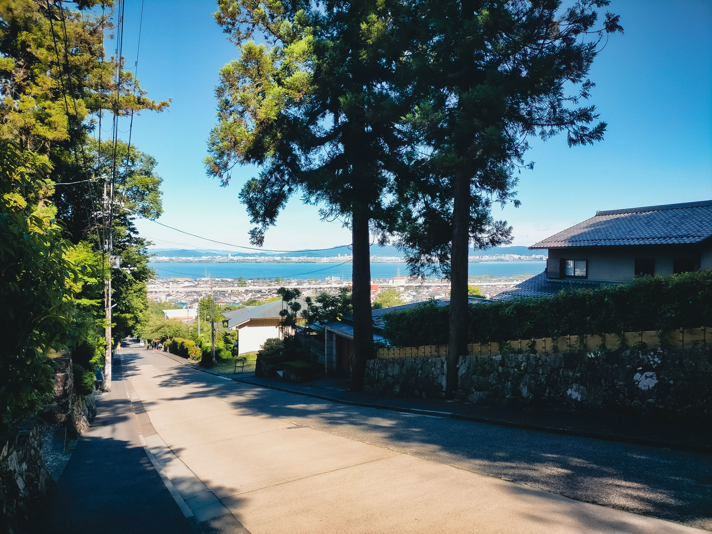

<head prefix="og: http://ogp.me/ns# fb: http://ogp.me/ns/fb# article: http://ogp.me/ns/article#">
  <meta property="og:title" content="Gallery" />
  <meta property="og:type" content="article" />
  <meta property="og:url" content="https://juten10x.github.io/gallery/" />
  <meta property="og:image" content="https://juten10x.github.io/images_for_ogp/IMG_2579.jpeg" />
  <meta property="og:site_name" content="juten10x.github.io" />
  <meta name="twitter::card" content="summary_large_image" />
  <!-- <meta property="og:description" content="ページのディスクリプション" /> -->
  <!-- <meta property="og:locale" content="ローカル言語" /> -->
</head>

撮った写真を不定期で1枚載せます．

