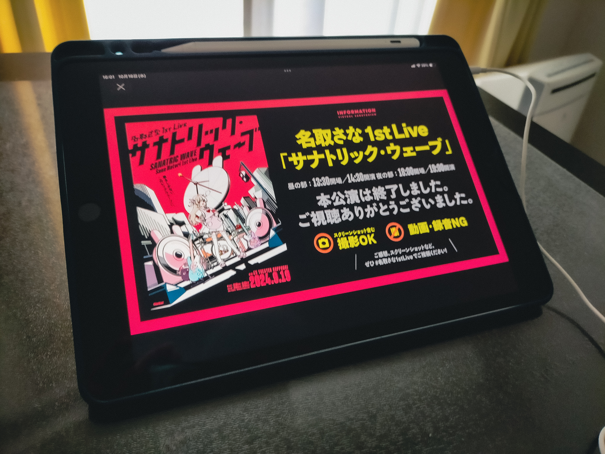

## 名取さな1stLive（昼・マルチアングル）感想 - Oct 23, 2024

こんにちは。

この記事は「名取さな1stLive」、もとい、「サナトリック・ウェーブ」を諸般の事情により約1か月遅れで観ることになった私の感想になります。（…というか、書き終えてから見返すと、いまの自分の気持ちを整理するために書いている節もあったので、かなり長い文章になってしまっていますし、前書きも長くなってしまい、もはや感想というよりは長い独り言みたいになっていますね。）

### 背景

以下、ネタバレを含みます。

まず、やっぱり観れて良かったです、本当に。私は最近まで現実世界のタスクが非常に多く、さらにはそれは重いものでもあったので、そもそも当日は観れず、もしかするとアーカイブ配信期間中にも観れないのでは…？という状況でしたが、何とかタスクをこなし、観れる時間を見つけられました。いやはや…。

また、私は最近（今年の8〜9月くらいから）名取さなさんの配信を観るようになったばかりであり、お恥ずかしながら、ライブ開催当日ですら、名取さんのこれまでリリースしている曲をまだあまり聴けていなかったりするという感じでした。それでも、このライブが開催されると知り、ライブの際の心構えについての配信や、ライブ前々日配信も観ましたし、やはりライブにも行きたかったのですが、私はそのとき（現在もですが）受験生という立場にあるため、特に平日はそういった時間はとれませんでした。そして当日を迎え、高校の授業の休憩時間に「あと数分で、東京の六本木ではライブが始まるのだなあ」と思いGoogle検索で「名取さな」と調べてみると（学校のiPadにはフィルタリングがかけられており、私はそれを故意に突破しようとはしていないため、いつも学校ではGoogle検索のリザルトに表示される数ツイートから情報を追っています）、表示された数分前のツイートには「ゲ（略）」とあり、面白かったです。そしてその日は、500kmくらい離れた場所で行われているライブに想いを馳せつつ、授業を受けました。そして家でTwitter（X?）をみていると、トレンド1位（！？）になってうんデリの呪縛から解き放たれてたり、夜公演も無事に終了した（よかった〜）ことを知ったり、アンコール（！！？）があったことや、新曲（！！！？）が発表されたり、ライブT（！！！！？）の衣装が披露されたことなどを知り、かなりうおっていました（「うおおお（略）」と言うことを「うおる」と形容している、と解釈してこの表現を使ってみました）。

そんな感じで当日を過ごしていたわけですが、実際には私はまだ曲をあまり聴けてない状態であるということを思い出し、その日から特に数日間は、いとまを見つけては曲を聴くことを繰り返していました。正直、私はそれまでには「モンダイナイトリッパー！」や「パラレルサーチライト」くらいしか聴けていなかったのですが、「PINK,ALL,PINK!」や「アニマルま〜る」、「オヒトリサマ」などを聴き、名取さんにはこんな表情もあって、こういった表現もしたりするのか〜と驚きましたし、特に「いっかい書いてさようなら」を聴いたときの衝撃はすごかったです。長くなりますが、以下に書きます。

初めてこの曲を聴いて、名取さなさんの歌、歌詞、メロディーなど、本当に全てがめっちゃ良くて、良すぎて悶えて、少し泣いたりもしました。曲を再生した瞬間から、椅子の上でうずくまってしばらく動けないようになったり感情がぐわーっと動いたりするのは初めてで、自分でもかなり驚きました。まずはメロディー。浮遊感のある電子音が全体にあって、ポップで、でも落ち着いていて。サビの部分の音階の変化のしかたや、一瞬音が消える部分に、特に強く感情を揺さぶられました。歌詞もすごく好きで、アイドル的で、その一方でコミュニケーションをする上での難しさやインターネットとの付き合い方についても述べられている、という風に私は解釈しているのですが、特に「おんなじ色が〜とるわけじゃないらしい」の部分では、現実世界において、またインターネット上において、相手とコミュニケーションをとる上で気をつけるべきことが非常に端的に描かれているように思います。そのようなことが、かたい言葉でなく、こうした言葉に敷衍されて、さらには歌という形でこちらに届いている、そういった側面から見ても、やっぱり歌ってすごいなと思います。そして何より、名取さんによる歌唱。音への声の乗せ方や、歌詞に合わせた感情表現がかなり好きです。というか、そもそも名取さなさんが歌っている、という時点で「うおおお（略）」となる、といった方がいいのかもしれません。（語弊があるかもですが、）普段は配信やTwitterでワイワイ騒いでたりするけれども、その一方ではこうしてアーティスト然として歌を歌っている、というギャップに惹かれたり、また魅力に感じたりする、というのが本質的な部分なのかも。名取さん自身はきっと多大な努力をしていて、様々な側面からその「名取さな」という存在をさらに磨いているのだろうと思います。配信やTwitterでの話は面白いし絵が上手くてかわいいしかっこよくて、感情や伝えたいことを歌に乗せて歌ったりもしている、そういった姿は名取さん自身によって生み出されている。そうした、なんと言いましょうか、多面的で唯一性がある存在であるというところが、本当にすごいし、魅力に感じられ、惹かれています。そして、名取さなさんには、おいしいご飯をたくさん食べて、楽しくて、ずっと幸せであって欲しいと、心から願っています。

話がそれましたが、とりあえずそんな感じで曲を聴いていきました。（「ゆびきりをつたえて」はTwitterやnoteとかでﾁﾗｰｯと情報を得て、大切な曲なのだと知ったので、まだ聴いていません。2023年のばくたん。をアーカイブで観るときに初めて聴くことになると思います。）そして、ほぼ全ての曲を聴き終えたときには既に「ソラの果てまで」がリリースされていました。ここで、「この曲はライブのアーカイブ映像にて初めて聴くようにしたい」という気持ちと、「アーカイブの配信期間を考えると観れないかもしれないし、どちらにせよ早く聴きたい〜」という気持ちがせめぎあい、結局ﾁﾗｰｯと聴くだけにしておきました（この段落でのﾁﾗｰｯととは、パラノマサイトの初めの配信の冒頭部分で名取さんが言っていたようなニュアンスで使っています）。

時は流れ、もうすぐライブから1か月が経とうとしているとき、やっと抱えていたタスクが一段落し、また様々なことが重なって学校が午前中で終わる日が発生し、ついに時間をとることができました。本当に良かった。そうして、晴れてアーカイブ配信期間が終了するより前に観る機会を得ました。

### ライブ

当日、緊張しつつも無事に昼の部・マルチアングルのチケットを購入し、家で昼食をとりました（ファミマの「スモークサーモン　ペッパーおむすび」、とても美味しいです）。チケットを買ってからは、昼食を食べる前もその最中も後も、感情が高まりすぎて少し踊ったりしていました（？）。椅子に座って机にiPadを置き、スマホを取り出してまずはライブ当日のTwitterでの名取さんやエビ、そしてせんせえたちの動きをチェックして当日の雰囲気を味わい、いよいよ観るときがきました。

再生ボタンを押してからは、しばらくはマウスコンピュータや文化放送、ZONeのCM、そして那須どうぶつ王国のPVが流れ、さながら映画館で上映を待っているときのようで、とてもワクワク感がありました。特に那須どうぶつ王国の映像はとても良くて、もともとあった訪れたい気持ちがさらに強くなりました（遠方なのでまだしばらくは厳しいですが…）。さて、そういう感じで待っていると、西郷・R・いろりの声が！（もごパ2もいつか観たい！）。「ゲ（略）」にも触れられていて、うおお本当にその場で喋っている！となったりしました。せんせえたちは話のひとつひとつに盛んに反応していて楽しそうだったので、私もTwitterのツリーでいろいろ反応を呟いてみたりしました。

そしていろりがフェードアウトしてしばらくするとカウントダウンが始まり、うおおおと思うと同時に、先月にアーカイブで観た初期の配信「【雑談】名取と共に地獄に叩き落されるせんせえがた」のカウントダウンのシーンを思い出し、もしかしてそのネタもあるのかな？とか予想しましたが流石にありませんでした。そして惑星ループが始まり、手元にペンライト代わりに置いていた扇子を持って振って（小声で）コールしつつ、歌を聴きました。私は音楽のライブには一度も参加したことがなく、またインターネット上で観たことがあるのはライブのワンシーンを公式が切り抜いたものであったりしたので、実質的にはこれが（アーカイブでの参加ではあるけれども）初めてのライブへの参加となりました。生バンドでの演奏で、ライブハウスの照明や映像などの演出も豪華であり、一気に雰囲気に呑まれました。今回、照明を消して暗くした部屋にiPadを置き再生しイヤフォンで聴く、そして手には扇子を持つというスタイルで臨みましたが、画面の向こうに広がる空間に引き込まれ、いつの間にか視界からは目の前の机や部屋すら無くなり、ただ画面が見えるという状態になっていました。それほどに没入感があり、音、映像、そして雰囲気も届いていました。また、今回のARカメラの演出も本当に素晴らしくて、実際の会場のライトや後に出る火花すらも写っていて、さながら名取さんがあの場所に立っているかのように感じられ感動しましたし、名取さんの上半身が映ることにより、歌のなかでの感情表現がより伝わってきて、とても良かったです。直前まで開発してくださったスタッフの方々に圧倒的感謝…！

そして、ファンタスティック・エボリューションでテンションを上げていき、PINK,ALL,PINK!ではアイドル然とした姿にコールを送り、MCを聴いてせんせえ方と名取さんのコミュニケーションを楽しみ、だじゃれくりえいしょんでは王のビームを浴び、アニマルま〜るではダンスするうさちゃんせんせえを観測、続いてのMCではやしきんさんに感謝を叫び、ごほうびトキメキモードではおいしいご飯を想像し、わたしたちのクエストという素敵な曲を聴き（私はブルアカ未履修です…）、初めて知ったときのように新曲に驚き、ノーゲスト、イン、ザ、テアトロ。の音に浸って、MCパートでミツキヨさんに感謝しつつ、続くオヒトリサマで一転した雰囲気と姿に酔い、アンハッピーリフレインと八月、某、月明かりではさらに感情が揺さぶられました。次にあったMCでは、歌を通じてなら言いづらい負の感情も伝えることができること、ただ漠然と歌うのではなく音楽を通じて伝えたいことがあるということ、音楽活動はこのライブが終着点ではなく、これからもずっと続いていくという言葉を聴きました。そして「ソラの果てまで」を聴き心打たれて、MCパートでは声援を送りました。「残り2曲」という言葉を聴いて「え〜」と言うせんせえ方を暖かく見守り、パラレルサーチライトが始まってバンドアレンジのすごさに圧倒されたり輝く火花に驚いて、足跡でもたくさんコールをして、跳びました。

（続きを書く）
